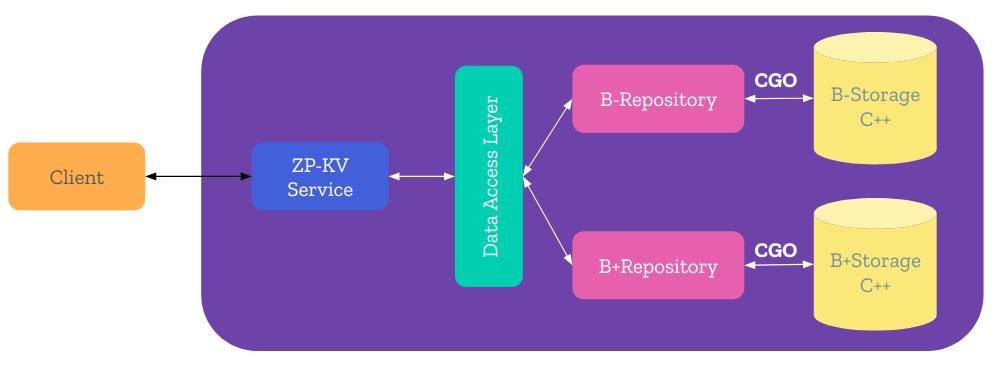

# **ZP Key-Value Store**  

  [](https://github.com/zalopay-oss/key-value-store-service) [](https://github.com/zalopay-oss/key-value-store-service/graphs/contributors) [](https://github.com/zalopay-oss/key-value-store-service/issues)

<!-- TOC -->
[**ZP Key-Value Store**](#zp-key-value-store)
- [ZP Key-Value Store](#zp-key-value-store)
  - [Overview](#overview)
  - [Architecture](#architecture)
  - [Requirements](#requirements)
  - [Methods supported](#methods-supported)
  - [Build](#build)
  - [Run](#run)
  - [Test](#test)
    - [Test CLI](#test-cli)
    - [Run unit tests](#run-unit-tests)
  - [Benchmark](#benchmark)
  - [Contribution](#contribution)
  - [Acknowledgements](#acknowledgements)

## **Overview**  

The implementation of Key-Value Store project of ZaloPay fresher program. In this project, we choose B-Tree and B+Tree data structures to organize and manipulate data. Key-Value Storage is written in C++ and Service layer is written in Golang programming language. We use gRPC services to handle requests from client and use CGO to access data from C++ storage.  

## **Architecture**  

<div align="center">
    
</div>  

## **Requirements**  

- C++17
- Golang 1.13.1
- Locust
- Python 3.7.3
- Docker Engine - Community 19.03.3  

## **Methods supported**  

```java
syntax = "proto3";

package service;

service KeyValueStoreService {
    rpc Connect(ConnectionRequest) returns (MessageResponse){}
    rpc CloseConnection (CloseConnectionRequest) returns (MessageResponse) {}
    rpc Get (GetRequest) returns (GetResponse) {}
    rpc Set (SetRequest) returns (MessageResponse) {}
    rpc Remove (RemoveRequest) returns (RemoveResponse) {}
    rpc Exist (ExistRequest) returns (ExistResponse) {}
}
```  

## **Build**  

```sh
# clone project
git clone https://github.com/zalopay-oss/key-value-store-service.git
```  

## **Run**  

- Make CGO understands C++17

```sh
# Modify Go enviroment variable
export CGO_CXXFLAGS="-g -rdynamic -std=c++17 -o -pthread
```  

- Run server:  

```sh
# ./source
cd source

# Build server
make build-server

# Run server
./server
```  

- Or run Docker server:  

```sh
# ./source
cd source

# Build docker image named "zpkv-server"
docker build -t zpkv-server .

# Run image
docker run -it --net="host" zpkv-server
```

- Run client:  

```sh
# ./source
cd source

# Build and run client
make client
```  

## **Test**  

### Test CLI

- **Connect** to B/B+ Storage:
```sh
# CONNECT {B | BPLUS}
KVZP > CONNECT B
OK
```  

- **Disconnect** to the storage:
```sh
# CLOSE
KVZP > CLOSE
OK
```
- **Insert** new Key-Value:
```sh
# SET key value
KVZP > SET a a
OK
```
- **Get** value from key:
```sh
# GET key
KVZP > GET a
"a"
```
- **Remove** key:
```sh
# {REMOVE|DEL} key
KVZP > DEL a
OK
```
- Check whether key **exists** in storage or not.
```sh
# EXIST key
KVZP > EXIST a
FALSE
```
- Exit program
```sh
KVZP > exit
Bye bye!!
```  

### Run unit tests  

```sh
# ./source
cd source
# run test
make test
```  

## **Benchmark**  

You can view benchmark results at [here](docs/benchmark.md).  

P99 overview (miliseconds)

| Percentile | Storage | Exist | Get | Remove | Set  |
|------------|---------|-------|-----|--------|------|
| 50%        | B-Store | 20    | 19  | 88     | 110  |
|            | B+Store | 21    | 20  | 87     | 110  |
| 99%        | B-Store | 36    | 35  | 270    | 270  |
|            | B+Store | 39    | 37  | 250    | 270  |
| 100%       | B-Store | 71    | 59  | 880    | 1000 |
|            | B+Store | 77    | 75  | 810    | 1000 |

## **Contribution**  

If you find anything wrong or want to discuss more about this project, feel free to create issues or create pull requests.  

## **Acknowledgements**  

Thanks [AJ Pham](https://github.com/phamtai97) for guiding me during the project.  

