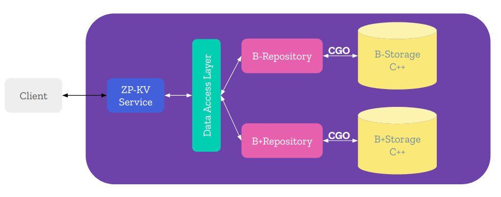

# **ZP Key-Value Store**  

## **Overview**  

Key-Value Store is the simplest type of database where each key is only mapped with one value. However, implementing a key-value store and store data on disk is a bit challenged because you have to cope with several problems about memory leak, race condition in multithreading environment, read/write file, I/O optimization.  

In this project, we use B-Tree and B+Tree data structures to organize and manipulate data. Service layer is written in Golang programming language. We use gRPC services to handle requests from client and use CGO to access data from C++ storage.  

## **Architecture**  

<div align="center">
    
</div>  

## **Requirements**  

- C++17
- Golang
- Locust
- Docker  

## **Methods supported**  

- **Connect** to B/B+ Storage:

> CONNECT {B | BPLUS}

- **Disconnect** to the storage:

> CLOSE

- **Insert** new Key-Value:

> SET key value

- **Get** value from key:

> GET key

- **Remove** key:

> REMOVE key

or

> DEL key

- Check whether key **exists** in storage or not.

> EXIST key

## **Build**  

```sh
git clone 
```

## **Run**  

- Make CGO understands C++17

```sh
export CGO_CXXFLAGS="-g -rdynamic -std=c++17 -o -pthread
```  

- Run server:  

```sh
make server
```  

- Or run docker server:  

```sh
sudo docker build -t zpkv-server .
sudo docker run -it --net="host" zpkv-server
```

- Run client:  

```sh
make client
```  

## **Test**  

```sh
make test
```  

## **Benchmark**  

You can view a benchmark result at [here](docs/benchmark.md)

## **Contribution**  

If you find anything wrong or want to discuss more about this project, feel free to create issues or create pull requests.  

## **Acknowledgements**  

Thanks [AJ Pham](https://github.com/phamtai97) for guiding me during the project.  

Thanks [Quyen Pham](https://github.com/ptq204) for sharing great ideas with me.  