## **GodBee-Benchmark**  

Bechmark with Locust and Boomer.
Run with 1000 users, Hatch rate 250.

Benchmark system:

- ThinkPad X280
- Intel(R) Core(TM) i5-8250U CPU @ 1.60GHz
- 2x8GiB SODIMM DDR4 2400 MHz
- Ubuntu 19.04

### **1. Set**  

#### **B-Tree**  

    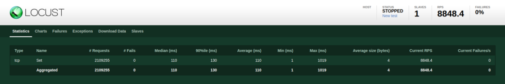

  

    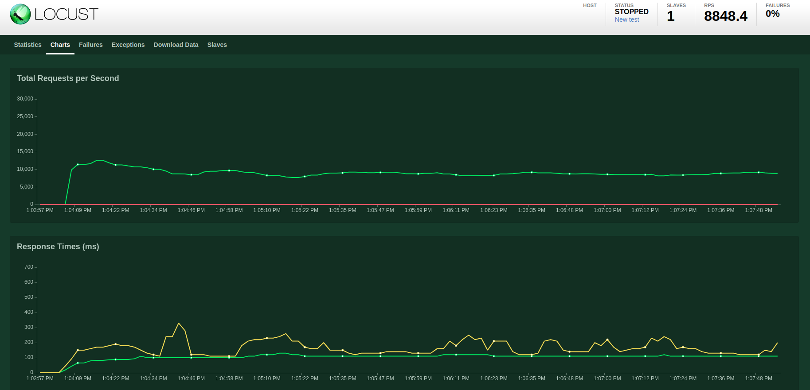

  

#### **B+Tree**  

    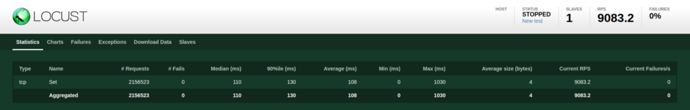

  

    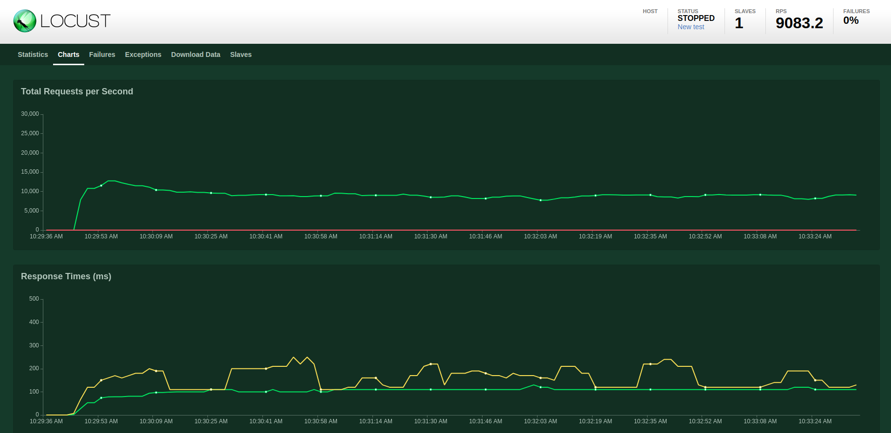

  

### **2. Get**  

#### **B-Tree**  

    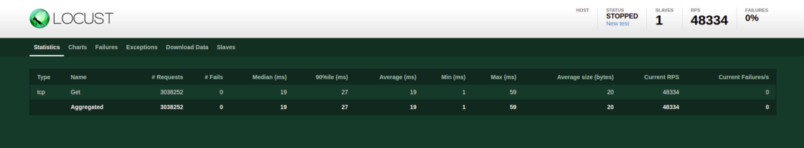

  

    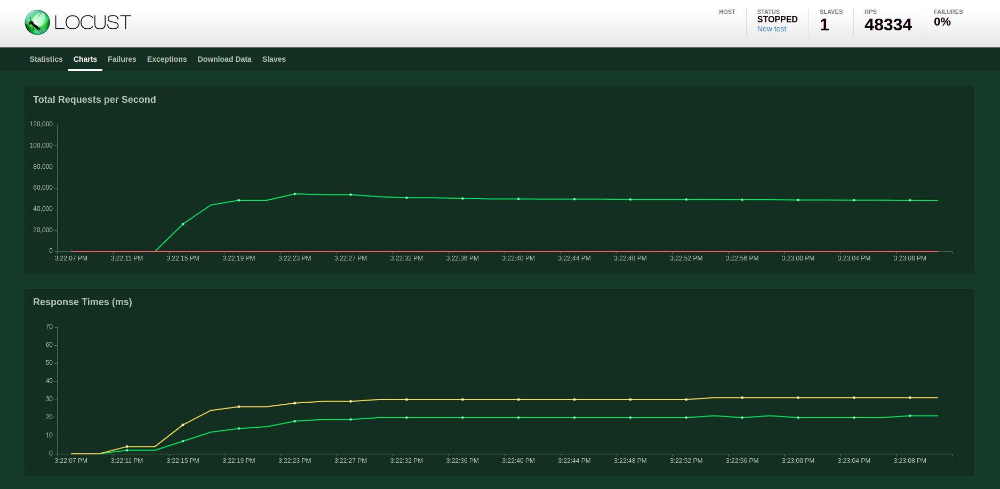

  

#### **B+Tree**  

    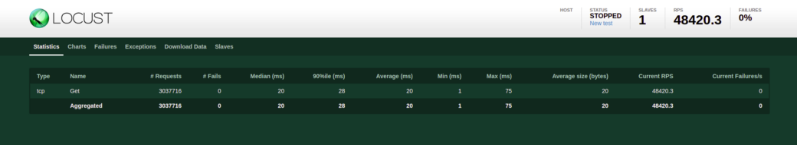

  

    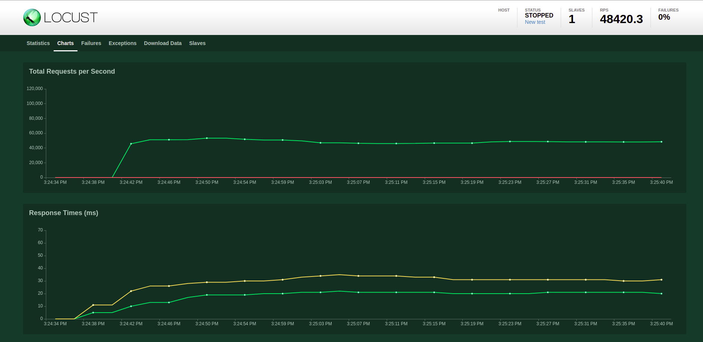

  

### **3. Exist**  

#### **B-Tree**  

    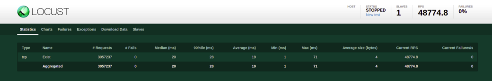

  

    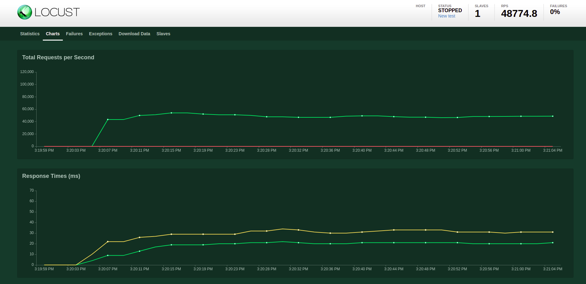

  

#### **B+Tree**  

    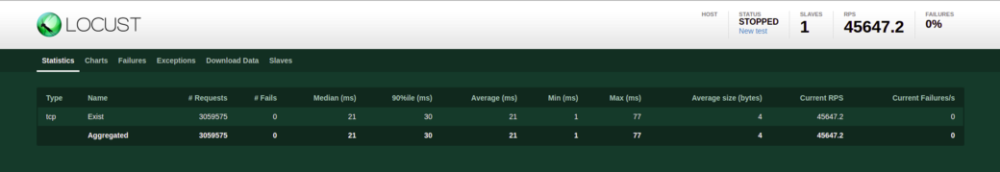

  

    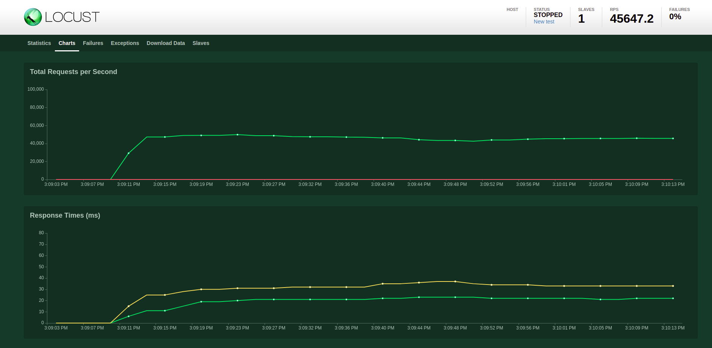

  

### **4. Remove**  

#### **B-Tree**  

    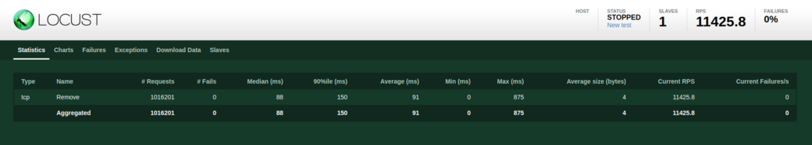

  

    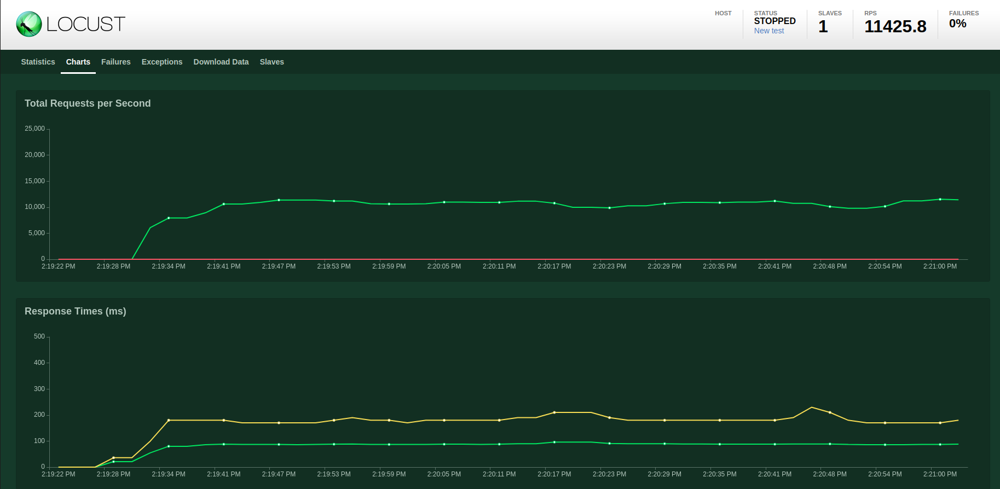

  

#### **B+Tree**  

    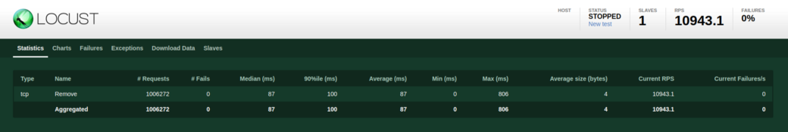

  

    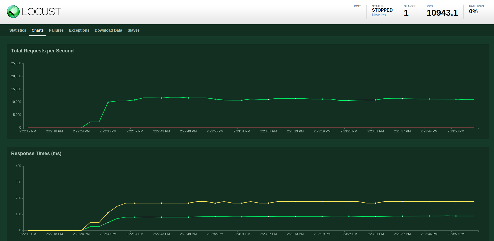

  

### **5. P99**  

P99 overview (miliseconds)

| Percentile | Storage | Exist | Get | Remove | Set  |
|------------|---------|-------|-----|--------|------|
| 50%        | B-Store | 20    | 19  | 88     | 110  |
|            | B+Store | 21    | 20  | 87     | 110  |
| 99%        | B-Store | 36    | 35  | 270    | 270  |
|            | B+Store | 39    | 37  | 250    | 270  |
| 100%       | B-Store | 71    | 59  | 880    | 1000 |
|            | B+Store | 77    | 75  | 810    | 1000 |
