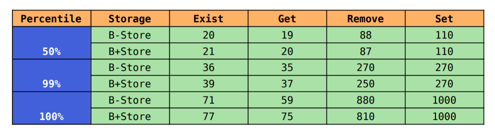

## **ZPKV-Benchmark**  

### **1. Set**  

#### **B-Tree**  

    

  

    

  

#### **B+Tree**  

    

  

    

  

### **2. Get**  

#### **B-Tree**  

    

  

    

  

#### **B+Tree**  

    

  

    

  

### **3. Exist**  

#### **B-Tree**  

    

  

    

  

#### **B+Tree**  

    

  

    

  

### **4. Remove**  

#### **B-Tree**  

    

  

    

  

#### **B+Tree**  

    

  

    

  

### **5. P99**  

    

  